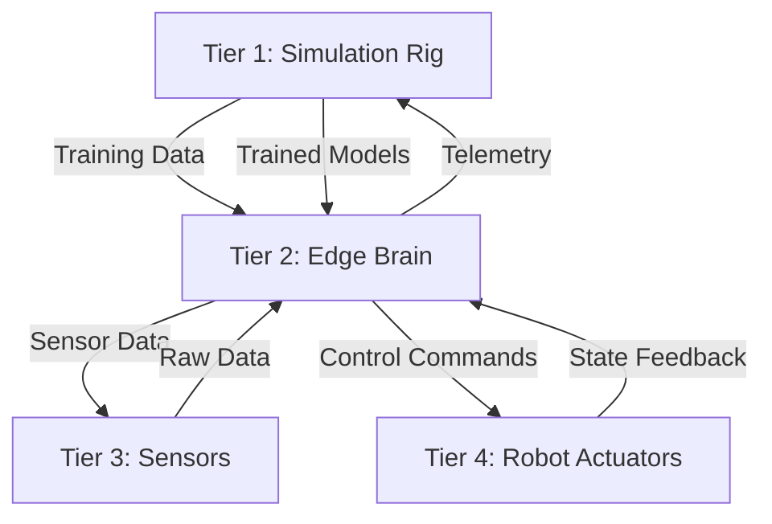
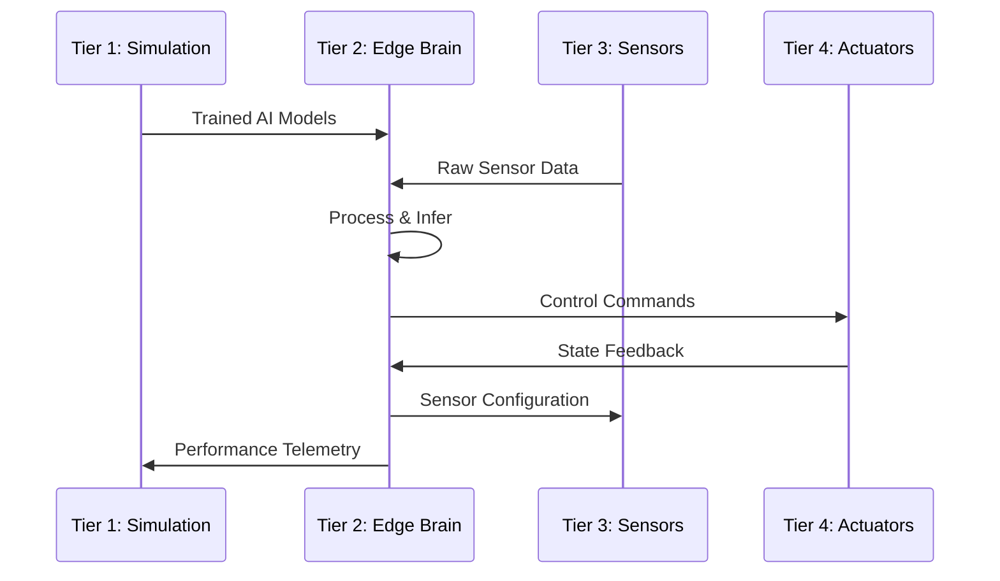

# Hardware Architecture

## 4-Tier Architecture Overview

To effectively manage the complexity of humanoid robotics and leverage distributed computing resources, this course employs a robust **4-tier architectural model**. This tiered approach ensures clear separation of concerns, optimizes computational load, and balances real-time performance with scalable AI training.



---

## Tier 1: Simulation Rig (Development and Training)

### Description
High-performance workstations and cloud instances for development, simulation, and AI training.

### Components

#### On-Premise RTX Lab

**Workstation Specifications:**
- **GPU:** NVIDIA RTX 4070, 4080, or 4090
- **CPU:** Intel Core i7/i9 or AMD Ryzen 7/9 (8+ cores)
- **RAM:** 32GB minimum, 64GB recommended
- **Storage:** 1TB+ NVMe SSD
- **OS:** Ubuntu 22.04 LTS

**Purpose:**
- ROS 2 application development
- Digital twin creation (Gazebo/Unity)
- Isaac Sim photorealistic simulation
- AI model training (vision, locomotion, manipulation)

#### Cloud "Ether" Lab

**Cloud Infrastructure:**
- **Platform:** AWS g5/g6e instances
- **GPU:** NVIDIA A100 or H100
- **Scalability:** On-demand compute resources

**Purpose:**
- Large-scale AI training
- Distributed simulation
- Batch data processing

### The Latency Trap ⚠️

> **Critical Consideration:** While cloud resources offer immense flexibility, round-trip communication latency between physical robots and remote servers can severely hinder real-time control loops.
>
> **Impact:** Delays of 50-200ms are common in cloud communication, which is unacceptable for:
> - Balance control (requires &lt;10ms response)
> - Collision avoidance (requires &lt;50ms response)
> - Dynamic manipulation (requires &lt;20ms response)
>
> **Solution:** Use cloud for offline training and edge devices for real-time control.

---

## Tier 2: Edge Brain (Real-time Processing)

### Description
NVIDIA Jetson Edge Kits deployed on or near the physical robot, serving as the localized "brain" for real-time processing.

### Jetson Edge Kits

#### NVIDIA Jetson Orin Nano

**Specifications:**
- **GPU:** 1024-core NVIDIA Ampere
- **CPU:** 6-core Arm Cortex-A78AE
- **RAM:** 8GB
- **AI Performance:** 40 TOPS
- **Power:** 7-15W

**Use Cases:**
- Entry-level edge AI
- Basic perception tasks
- Sensor data preprocessing

#### NVIDIA Jetson Orin NX

**Specifications:**
- **GPU:** 1024-core NVIDIA Ampere
- **CPU:** 8-core Arm Cortex-A78AE
- **RAM:** 16GB
- **AI Performance:** 100 TOPS
- **Power:** 10-25W

**Use Cases:**
- Advanced perception
- Real-time SLAM
- Local AI inference
- Multi-sensor fusion

### Functions

✅ Execute real-time control loops  
✅ Run critical ROS 2 nodes (motor controllers, VSLAM)  
✅ Perform on-device AI inference  
✅ Handle sensor data preprocessing  
✅ Maintain low-latency operation  

---

## Tier 3: Sensors (Perception Input)

### Description
Sensory hardware attached to the robot for environmental perception and proprioception.

### Common Sensors

#### Intel RealSense D435i

**Type:** RGB-D Camera with IMU

**Specifications:**
- **RGB Resolution:** 1920×1080 @ 30fps
- **Depth Resolution:** 1280×720 @ 90fps
- **Depth Range:** 0.3m to 3m
- **FOV:** 87° × 58° (depth)
- **IMU:** 6-axis (accelerometer + gyroscope)

**Applications:**
- Visual SLAM
- Object detection and recognition
- Depth estimation for manipulation
- Obstacle avoidance

#### IMU (Inertial Measurement Unit)

**Type:** 6-axis or 9-axis sensor

**Measurements:**
- **Accelerometer:** Linear acceleration (3-axis)
- **Gyroscope:** Angular velocity (3-axis)
- **Magnetometer:** Magnetic field (3-axis, if 9-axis)

**Applications:**
- Robot orientation estimation
- Balance control
- Odometry
- State estimation

#### ReSpeaker Mic Array

**Type:** Multi-microphone array

**Specifications:**
- **Microphones:** 4-6 channels
- **Sampling Rate:** 16kHz
- **Features:** Beamforming, noise suppression, echo cancellation

**Applications:**
- Far-field speech recognition
- Voice command input
- Sound source localization
- Human-robot interaction

### Sensor Integration

```python
# Example: Multi-sensor data fusion
class SensorFusion:
    def __init__(self):
        self.camera_sub = rospy.Subscriber('/camera/image', Image, self.camera_callback)
        self.imu_sub = rospy.Subscriber('/imu/data', Imu, self.imu_callback)
        self.depth_sub = rospy.Subscriber('/camera/depth', Image, self.depth_callback)
    
    def fuse_data(self):
        # Combine visual and inertial data for robust state estimation
        visual_pose = self.vslam.get_pose()
        imu_orientation = self.imu_filter.get_orientation()
        
        # Kalman filter fusion
        fused_state = self.kalman_filter.update(visual_pose, imu_orientation)
        return fused_state
```

---

## Tier 4: Robot Actuators (Physical Interaction)

### Description
The physical body of the humanoid robot, comprising joints, motors, and end-effectors.

### Robot Platforms

#### Unitree Humanoid Robots

**Unitree H1**

**Specifications:**
- **Height:** 180cm
- **Weight:** 47kg
- **DOF:** 25+ joints
- **Actuators:** High-torque servo motors
- **Battery:** 15Ah (90 minutes runtime)
- **Payload:** 30kg

**Capabilities:**
- Bipedal locomotion
- Whole-body manipulation
- Dynamic balance
- Outdoor operation

**Unitree G1** (Alternative)

**Specifications:**
- **Height:** 130cm
- **Weight:** 35kg
- **DOF:** 23 joints
- **Focus:** Research and education

### Actuator Control

```python
# Example: Joint control interface
class JointController:
    def __init__(self, robot):
        self.robot = robot
        self.joint_states_sub = rospy.Subscriber('/joint_states', JointState, self.state_callback)
        self.joint_cmd_pub = rospy.Publisher('/joint_commands', JointCommand, queue_size=10)
    
    def send_position_command(self, joint_positions):
        """Send position commands to robot joints"""
        cmd = JointCommand()
        cmd.names = self.robot.joint_names
        cmd.positions = joint_positions
        cmd.kp = [100] * len(joint_positions)  # Position gain
        cmd.kd = [10] * len(joint_positions)   # Damping gain
        self.joint_cmd_pub.publish(cmd)
```

---

## Lab Configurations

### Proxy Lab (Simulation-Focused)

**Equipment:**
- On-Premise RTX Lab workstations (5-10 units)
- Optional Cloud "Ether" Lab access
- No physical robots

**Approach:**
- All development in simulation
- Digital twins for all experiments
- Focus on software and algorithms

**Cost:** Low (hardware only)

**Best For:** Budget-constrained institutions, remote learning

---

### Mini Lab (Hybrid)

**Equipment:**
- On-Premise RTX Lab workstations (5-10 units)
- Jetson Edge Kits (2-3 units)
- Limited Unitree robots (1-2 units)

**Approach:**
- Primary development in simulation
- Limited hardware deployment
- Demonstrations on physical robots

**Cost:** Medium

**Best For:** Universities with moderate budgets

---

### Premium Lab (Full Hardware)

**Equipment:**
- On-Premise RTX Lab workstations (10+ units)
- Dedicated Jetson Edge Kits per team (5+ units)
- Multiple Unitree robots (3-5 units)
- Full sensor suite for each robot

**Approach:**
- Simulation for rapid prototyping
- Extensive hardware testing
- Real-world deployment focus

**Cost:** High

**Best For:** Research institutions, industry partnerships

---

## Data Flow Architecture



---

## Key Takeaways

🔑 **4-tier architecture** separates development, edge processing, sensing, and actuation  
🔑 **Simulation rigs** enable fast development and AI training  
🔑 **Edge devices** handle real-time control to avoid latency issues  
🔑 **Sensor fusion** combines multiple modalities for robust perception  
🔑 **Lab configurations** can be adapted to different budgets and goals  

---

**Navigation:**  
← [Assessments](../course-structure/assessments.md) | [Glossary →](../reference/glossary.md)
