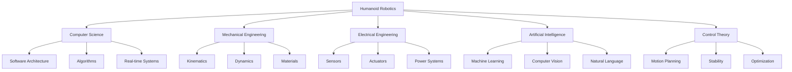

# Chapter 1: Introduction to Physical AI and Embodied Intelligence

## From Digital to Physical Intelligence

The field of Artificial Intelligence has made remarkable strides in recent decades, primarily in the digital realm. We've seen breakthroughs in:

- **Natural Language Processing** - ChatGPT, translation systems, text generation
- **Computer Vision** - Image recognition, object detection, facial recognition
- **Recommendation Systems** - Personalized content, product suggestions
- **Game Playing** - Chess, Go, video games

However, the true test of intelligence lies in an agent's ability to interact with and navigate the complex, dynamic, and often unpredictable **physical world**.

## What is Physical AI?

**Physical AI** is the study and development of intelligent systems that perceive, reason, and act within physical environments. Unlike purely digital AI that operates in controlled, deterministic software environments, Physical AI must contend with:

### Real-World Challenges

| Challenge | Description | Example |
|-----------|-------------|---------|
| **Physics** | Gravity, friction, inertia, momentum | A robot must account for its weight when walking |
| **Uncertainty** | Sensor noise, environmental variability | Camera images vary with lighting conditions |
| **Safety** | Physical consequences of actions | A robot arm must not collide with humans |
| **Real-time** | Immediate response requirements | Balance control must react in milliseconds |
| **Embodiment** | Physical constraints and capabilities | Robot form determines what tasks it can perform |

### The Sim-to-Real Gap

One of the fundamental challenges in Physical AI is the **sim-to-real gap** - the difference between simulated environments and the real world. While we can train AI in perfect simulations, transferring that knowledge to physical robots requires:

- Robust perception systems
- Adaptive control strategies
- Safety mechanisms
- Domain randomization techniques

## Embodied Intelligence

**Embodied intelligence** is a core concept asserting that an intelligent agent's cognitive capabilities are deeply intertwined with its physical body and environmental interactions.

### Key Principles

1. **Morphology Matters** - The physical form shapes cognitive abilities
2. **Sensorimotor Integration** - Perception and action are coupled
3. **Environmental Coupling** - Intelligence emerges from body-environment interaction
4. **Developmental Learning** - Skills develop through physical experience

### Example: Human vs. Robot Grasping

Consider how humans grasp objects:

- **Tactile Feedback** - We feel pressure, texture, temperature
- **Proprioception** - We sense our hand position without looking
- **Adaptive Control** - We adjust grip force based on object weight
- **Experience** - Years of practice inform our movements

For robots to achieve similar capabilities, they must:

- Integrate multiple sensor modalities (vision, force, tactile)
- Develop internal models of their own body (kinematics, dynamics)
- Learn from physical interaction and feedback
- Adapt to novel objects and situations

## Why Humanoid Robotics?

Humanoid robotics represents the **pinnacle of embodied intelligence** for several compelling reasons:

### 1. Human-Centric Environments

Our world is designed for human bodies:
- Doorknobs, stairs, chairs, tools
- Vehicles, buildings, workspaces
- Social spaces and interfaces

Humanoid robots can navigate and operate in these environments without requiring redesign.

### 2. Complex Motor Control

Humanoid robots require sophisticated control of:
- **20+ degrees of freedom** in the body
- **Bipedal locomotion** - Dynamic balance while walking
- **Dexterous manipulation** - Multi-fingered hands
- **Whole-body coordination** - Simultaneous arm and leg movements

### 3. Natural Human-Robot Interaction

Human-like form enables:
- **Intuitive communication** - Gestures, body language, eye contact
- **Social acceptance** - Humans are more comfortable with humanoid robots
- **Predictable behavior** - Human-like movements are easier to understand
- **Collaborative work** - Can work alongside humans naturally

### 4. Research Platform

Humanoids serve as excellent platforms for studying:
- Cognitive development and learning
- Sensorimotor integration
- Social intelligence
- General-purpose AI

## The Interdisciplinary Nature of Robotics

Building intelligent humanoid robots requires expertise from multiple fields:

## Course Approach: Digital Twins to Physical Robots

This course follows a systematic progression:

### Phase 1: Simulation (Digital Twins)
- Develop and test in safe virtual environments
- Iterate quickly without hardware constraints
- Generate synthetic training data

### Phase 2: AI Training
- Train perception and control systems
- Use photorealistic simulation (Isaac Sim)
- Leverage GPU acceleration

### Phase 3: Edge Deployment
- Deploy to embedded systems (Jetson)
- Optimize for real-time performance
- Implement safety mechanisms

### Phase 4: Physical Integration
- Transfer to real robots
- Fine-tune based on real-world feedback
- Validate in target environments

## Key Takeaways

🔑 **Physical AI** extends intelligence beyond the digital realm into the physical world  
🔑 **Embodied intelligence** recognizes that body and mind are inseparable  
🔑 **Humanoid robots** are ideal platforms for studying complex embodied intelligence  
🔑 **Interdisciplinary knowledge** is essential for robotics development  
🔑 **Simulation-to-reality** pipeline enables safe, efficient development  

## Reflection Questions

1. How does embodied intelligence differ from traditional AI approaches?
2. What unique challenges does Physical AI face compared to digital AI?
3. Why might a humanoid form be advantageous for certain tasks?
4. What are the ethical considerations of developing humanoid robots?

## Further Reading

- Brooks, R. A. (1991). "Intelligence without representation." *Artificial Intelligence*, 47(1-3), 139-159.
- Pfeifer, R., & Bongard, J. (2006). *How the Body Shapes the Way We Think*. MIT Press.
- Siciliano, B., & Khatib, O. (Eds.). (2016). *Springer Handbook of Robotics*. Springer.

---

**Navigation:**  
← [Module Overview](./overview.md) | [Chapter 2: ROS 2 Fundamentals →](./chapter-02-ros2-fundamentals.md)
