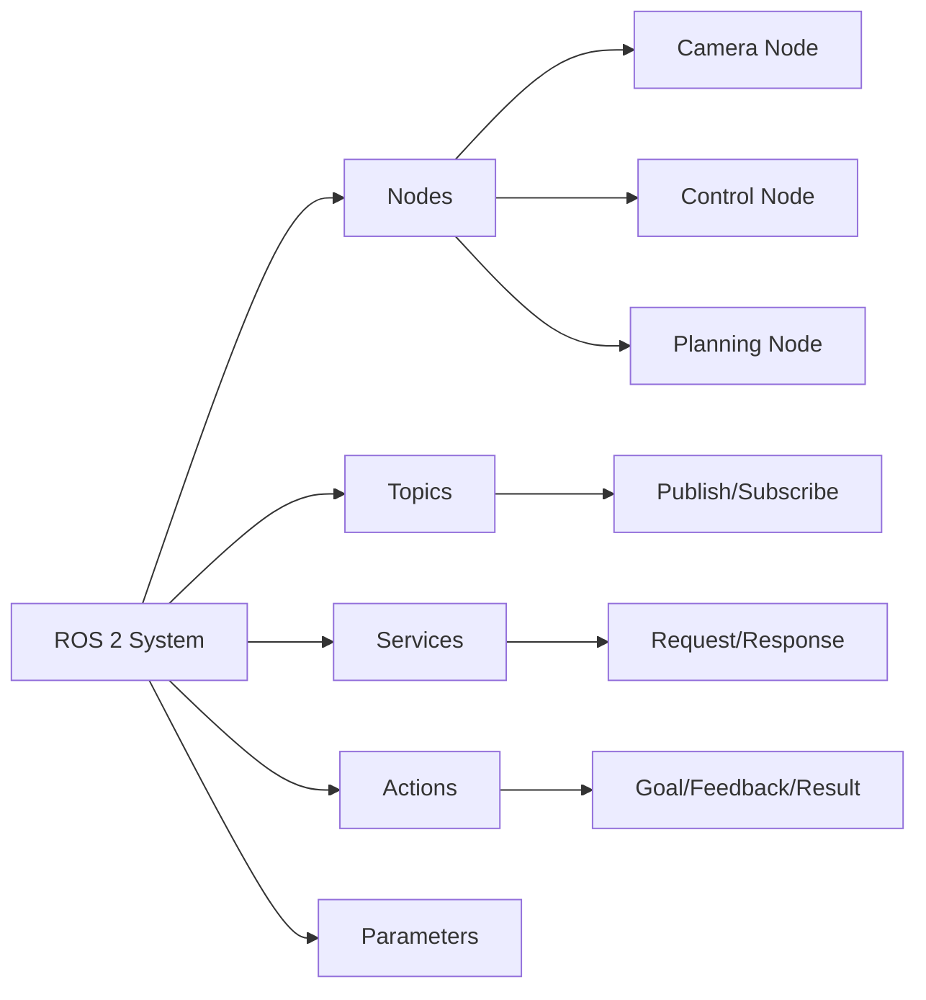
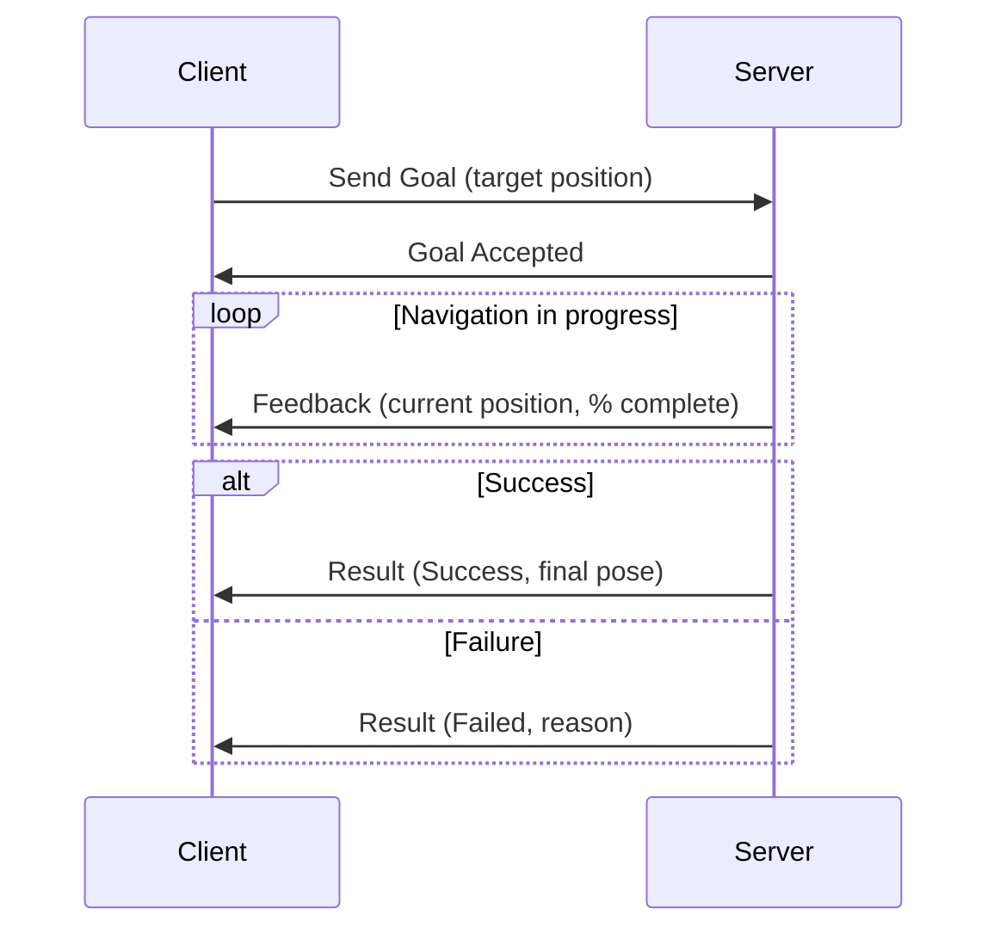

# Chapter 2: The Robotic Nervous System – ROS 2 Fundamentals

## Introduction to ROS 2

The **Robot Operating System (ROS)** has become the de facto standard in robotics research and development, providing a flexible framework for writing robot software. **ROS 2**, the latest iteration, offers improved real-time capabilities, security, and support for a wider range of platforms, making it ideal for advanced applications like humanoid robotics.

This chapter introduces ROS 2 as the "nervous system" of our humanoid robots, enabling communication and coordination between various components.

## ROS 2 Architecture Overview

ROS 2 operates on a **distributed architecture**, meaning different parts of a robot's software can run independently on various computational units while communicating seamlessly. This could include:

- A workstation for high-level planning
- An embedded system (Jetson) for real-time control
- Different machines across a network

### Key Benefits of Distributed Architecture

✅ **Modularity** - Components can be developed and tested independently  
✅ **Scalability** - Easy to add new capabilities without restructuring  
✅ **Robustness** - Failure of one component doesn't crash the entire system  
✅ **Maintainability** - Clear separation of concerns simplifies debugging  
✅ **Reusability** - Nodes can be shared across different robot projects  

### Core Components



## Nodes: The Brain Cells of a Robot

In ROS 2, a **node** is an executable process that performs a specific task. Think of nodes as individual "brain cells" or functional units within the robot's nervous system.

### Node Characteristics

- **Single-purpose** - Each node has one clear responsibility
- **Independent** - Can run on different machines or processors
- **Communicating** - Exchange data with other nodes
- **Language-agnostic** - Can be written in Python, C++, or other languages

### Example Node Responsibilities

| Node Name | Purpose | Inputs | Outputs |
|-----------|---------|--------|---------|
| `camera_driver` | Read camera data | Hardware | Image topic |
| `object_detector` | Detect objects | Image topic | Detection results |
| `motion_planner` | Plan robot movements | Goal pose | Joint trajectories |
| `motor_controller` | Control motors | Joint commands | Motor states |

### Creating a Simple Node (Python)

```python
import rclpy
from rclpy.node import Node

class MinimalNode(Node):
    def __init__(self):
        super().__init__('minimal_node')
        self.get_logger().info('Node has been started!')

def main(args=None):
    rclpy.init(args=args)
    node = MinimalNode()
    rclpy.spin(node)
    node.destroy_node()
    rclpy.shutdown()

if __name__ == '__main__':
    main()
```

## Topics: Real-time Data Streams

**Topics** are the primary mechanism for real-time, one-way communication in ROS 2. They function like broadcast channels where nodes can publish data (send messages) and subscribe to data (receive messages).

### Publish-Subscribe Model

```mermaid
graph TD
    A[Camera Node] -->|publishes| B[/image_raw Topic]
    B -->|subscribes| C[Object Detector]
    B -->|subscribes| D[Visual SLAM]
    B -->|subscribes| E[Display Node]
    
    F[IMU Node] -->|publishes| G[/imu/data Topic]
    G -->|subscribes| H[State Estimator]
    G -->|subscribes| I[Balance Controller]
```

### Key Features

- **Asynchronous** - Publishers and subscribers don't wait for each other
- **Many-to-many** - Multiple publishers and subscribers per topic
- **Typed** - Each topic has a specific message type
- **Decoupled** - Publishers don't know who's listening

### Common Topic Types

| Message Type | Purpose | Key Fields |
|--------------|---------|------------|
| `sensor_msgs/Image` | Camera images | width, height, data |
| `sensor_msgs/Imu` | IMU data | orientation, angular_velocity, linear_acceleration |
| `geometry_msgs/Twist` | Velocity commands | linear.x, angular.z |
| `nav_msgs/Odometry` | Robot position | pose, twist |

### Publishing to a Topic (Python)

```python
from geometry_msgs.msg import Twist

class VelocityPublisher(Node):
    def __init__(self):
        super().__init__('velocity_publisher')
        self.publisher = self.create_publisher(Twist, 'cmd_vel', 10)
        self.timer = self.create_timer(0.1, self.publish_velocity)
    
    def publish_velocity(self):
        msg = Twist()
        msg.linear.x = 0.5  # Move forward
        msg.angular.z = 0.0  # No rotation
        self.publisher.publish(msg)
```

### Subscribing to a Topic (Python)

```python
from sensor_msgs.msg import Image

class ImageSubscriber(Node):
    def __init__(self):
        super().__init__('image_subscriber')
        self.subscription = self.create_subscription(
            Image,
            'camera/image_raw',
            self.image_callback,
            10
        )
    
    def image_callback(self, msg):
        self.get_logger().info(f'Received image: {msg.width}x{msg.height}')
```

## Services: Request-Response Communication

While topics are ideal for continuous data streams, sometimes a robot needs to perform a specific task and receive a direct response. This is where **services** come in.

### Service Characteristics

- **Synchronous** - Client waits for server response
- **One-to-one** - Single request, single response
- **Blocking** - Client blocks until response received
- **Typed** - Request and response have specific types

### Use Cases for Services

- **Configuration** - Set parameters, change modes
- **Queries** - Request current state, get information
- **Triggers** - Start/stop processes, reset systems
- **Computations** - Perform calculations, return results

### Service Example: Add Two Integers

```python
from example_interfaces.srv import AddTwoInts

class AdditionServer(Node):
    def __init__(self):
        super().__init__('addition_server')
        self.srv = self.create_service(
            AddTwoInts,
            'add_two_ints',
            self.add_callback
        )
    
    def add_callback(self, request, response):
        response.sum = request.a + request.b
        self.get_logger().info(f'{request.a} + {request.b} = {response.sum}')
        return response
```

### Calling a Service (Python)

```python
from example_interfaces.srv import AddTwoInts

class AdditionClient(Node):
    def __init__(self):
        super().__init__('addition_client')
        self.client = self.create_client(AddTwoInts, 'add_two_ints')
        
    def send_request(self, a, b):
        request = AddTwoInts.Request()
        request.a = a
        request.b = b
        future = self.client.call_async(request)
        return future
```

## Actions: Goal-Oriented Tasks with Feedback

For longer-running, more complex tasks that require ongoing feedback and the ability to be preempted, **actions** are used.

### Action Characteristics

- **Asynchronous** - Client doesn't block waiting for completion
- **Feedback** - Continuous progress updates
- **Cancelable** - Can be preempted or canceled
- **Result** - Final outcome when complete

### Action Components

1. **Goal** - What to achieve (e.g., "walk to kitchen")
2. **Feedback** - Progress updates (e.g., "50% complete")
3. **Result** - Final outcome (e.g., "arrived successfully")

### Use Cases for Actions

- **Navigation** - Move to a goal position
- **Manipulation** - Pick and place objects
- **Locomotion** - Execute walking gaits
- **Long computations** - Path planning, mapping

### Action Example: Navigation



## ROS 2 Package Structure

A **package** is the organizational unit in ROS 2, containing related nodes, libraries, configuration files, and dependencies.

### Standard Package Structure

```
my_robot_package/
├── package.xml          # Package metadata and dependencies
├── setup.py             # Python package setup
├── setup.cfg            # Configuration
├── resource/            # Package marker files
├── my_robot_package/    # Python source code
│   ├── __init__.py
│   ├── node1.py
│   └── node2.py
├── launch/              # Launch files
│   └── robot_launch.py
├── config/              # Configuration files
│   └── params.yaml
└── test/                # Unit tests
    └── test_node1.py
```

### Key Files

**package.xml** - Declares dependencies and metadata:
```xml
<?xml version="1.0"?>
<package format="3">
  <name>my_robot_package</name>
  <version>1.0.0</version>
  <description>My robot package</description>
  <maintainer email="you@example.com">Your Name</maintainer>
  <license>Apache-2.0</license>
  
  <depend>rclpy</depend>
  <depend>std_msgs</depend>
  <depend>geometry_msgs</depend>
</package>
```

## ROS 2 Workspace

A **workspace** is a directory containing one or more packages.

### Workspace Structure

```
ros2_ws/
├── src/                 # Source code (packages)
│   ├── package1/
│   └── package2/
├── build/               # Build artifacts
├── install/             # Installed packages
└── log/                 # Build and runtime logs
```

### Building a Workspace

```bash
cd ~/ros2_ws
colcon build
source install/setup.bash
```

## Assessment: ROS 2 Package Project

### Project Requirements

Design and implement a ROS 2 package for a basic robotic function with the following components:

1. **Multiple Nodes** (minimum 3)
   - At least one publisher node
   - At least one subscriber node
   - At least one service or action server

2. **Communication**
   - Demonstrate topic-based communication
   - Implement at least one service OR action
   - Proper message types and data flow

3. **Documentation**
   - Clear README explaining the system
   - Code comments explaining functionality
   - Architecture diagram showing node communication

4. **Testing**
   - Launch file to start all nodes
   - Demonstration of system functionality
   - Error handling and edge cases

### Example Project Ideas

- **Simulated Robot Controller** - Control a virtual robot with keyboard input
- **Sensor Data Pipeline** - Process and visualize sensor data
- **Multi-Robot Coordinator** - Coordinate multiple simulated robots
- **State Machine** - Implement a behavior tree or finite state machine

### Evaluation Criteria

| Criterion | Weight | Description |
|-----------|--------|-------------|
| Architecture | 30% | Proper node design, clear responsibilities |
| Communication | 30% | Correct use of topics, services, actions |
| Code Quality | 20% | Clean code, documentation, error handling |
| Functionality | 20% | System works as intended, meets requirements |

## Key Takeaways

🔑 **ROS 2** provides a distributed architecture for modular robot software  
🔑 **Nodes** are independent processes with single responsibilities  
🔑 **Topics** enable asynchronous, many-to-many communication  
🔑 **Services** provide synchronous request-response interactions  
🔑 **Actions** support long-running tasks with feedback and cancellation  
🔑 **Packages** organize related code, and **workspaces** contain packages  

## Further Reading

- ROS 2 Documentation: https://docs.ros.org/en/humble/
- ROS 2 Design: https://design.ros2.org/
- Quigley, M., et al. (2009). "ROS: an open-source Robot Operating System." *ICRA Workshop on Open Source Software*.

---

**Navigation:**  
← [Chapter 1: Physical AI](./chapter-01-physical-ai.md) | [Module 2: Digital Twins →](../module-02-digital-twins/overview.md)
