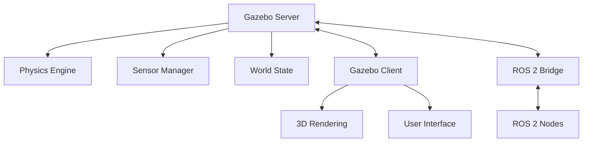
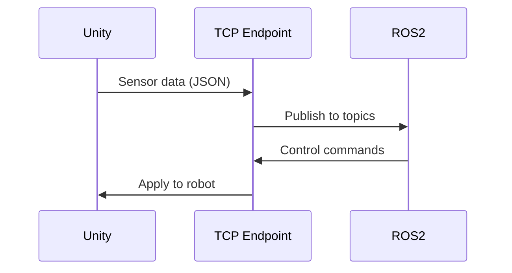

# Chapter 3: Digital Twins – Simulation and Visualization

## Introduction to Digital Twins

A **digital twin** in robotics is more than just a 3D model – it's a dynamic virtual counterpart that mirrors the physical robot's state, behavior, and environment. This includes accurately replicating:

- Physical properties (mass, inertia, joints)
- Sensor characteristics and noise
- Environmental factors (gravity, friction, collisions)
- Control systems and software stack

By connecting the digital twin to the same software (ROS 2) used by the physical robot, developers can run realistic simulations, debug issues, and train AI models much faster than with physical hardware alone.

## Gazebo: Physics-Based Simulation

**Gazebo** is a powerful, open-source 3D robotics simulator widely used in the ROS ecosystem. It provides a robust physics engine that accurately models rigid body dynamics, joint constraints, and sensor feedback.

### Key Features

- **Physics Engines:** ODE, Bullet, Simbody, DART
- **Sensor Simulation:** Cameras, LiDAR, IMU, force/torque sensors
- **Plugin System:** Extend functionality with custom code
- **ROS 2 Integration:** Seamless communication via ros2_control

### Gazebo Architecture



### Robot Modeling with URDF

**Unified Robot Description Format (URDF)** is an XML format for describing robot kinematics and dynamics.

#### Basic URDF Structure

```xml
<?xml version="1.0"?>
<robot name="simple_robot">
  <!-- Base Link -->
  <link name="base_link">
    <visual>
      <geometry>
        <box size="0.6 0.4 0.2"/>
      </geometry>
      <material name="blue">
        <color rgba="0 0 0.8 1"/>
      </material>
    </visual>
    <collision>
      <geometry>
        <box size="0.6 0.4 0.2"/>
      </geometry>
    </collision>
    <inertial>
      <mass value="10.0"/>
      <inertia ixx="0.1" ixy="0.0" ixz="0.0"
               iyy="0.1" iyz="0.0" izz="0.1"/>
    </inertial>
  </link>
  
  <!-- Joint -->
  <joint name="wheel_joint" type="continuous">
    <parent link="base_link"/>
    <child link="wheel_link"/>
    <origin xyz="0.3 0 -0.1" rpy="0 0 0"/>
    <axis xyz="0 1 0"/>
  </joint>
  
  <!-- Wheel Link -->
  <link name="wheel_link">
    <visual>
      <geometry>
        <cylinder radius="0.1" length="0.05"/>
      </geometry>
    </visual>
    <collision>
      <geometry>
        <cylinder radius="0.1" length="0.05"/>
      </geometry>
    </collision>
    <inertial>
      <mass value="1.0"/>
      <inertia ixx="0.01" ixy="0.0" ixz="0.0"
               iyy="0.01" iyz="0.0" izz="0.01"/>
    </inertial>
  </link>
</robot>
```

### XACRO: Programmable URDF

**XACRO** (XML Macros) extends URDF with programming features:

```xml
<?xml version="1.0"?>
<robot xmlns:xacro="http://www.ros.org/wiki/xacro" name="humanoid">
  
  <!-- Properties -->
  <xacro:property name="leg_length" value="0.5"/>
  <xacro:property name="leg_mass" value="2.0"/>
  
  <!-- Macro for creating legs -->
  <xacro:macro name="leg" params="prefix reflect">
    <link name="${prefix}_thigh">
      <visual>
        <geometry>
          <cylinder radius="0.05" length="${leg_length}"/>
        </geometry>
      </visual>
      <inertial>
        <mass value="${leg_mass}"/>
        <inertia ixx="0.01" ixy="0" ixz="0"
                 iyy="0.01" iyz="0" izz="0.01"/>
      </inertial>
    </link>
    
    <joint name="${prefix}_hip" type="revolute">
      <parent link="torso"/>
      <child link="${prefix}_thigh"/>
      <origin xyz="0 ${reflect*0.1} -0.2"/>
      <axis xyz="0 1 0"/>
      <limit lower="-1.57" upper="1.57" effort="100" velocity="1.0"/>
    </joint>
  </xacro:macro>
  
  <!-- Use macro for both legs -->
  <xacro:leg prefix="left" reflect="1"/>
  <xacro:leg prefix="right" reflect="-1"/>
  
</robot>
```

### Sensor Simulation in Gazebo

#### Camera Sensor

```xml
<gazebo reference="camera_link">
  <sensor type="camera" name="camera1">
    <update_rate>30.0</update_rate>
    <camera name="head">
      <horizontal_fov>1.3962634</horizontal_fov>
      <image>
        <width>800</width>
        <height>800</height>
        <format>R8G8B8</format>
      </image>
      <clip>
        <near>0.02</near>
        <far>300</far>
      </clip>
      <noise>
        <type>gaussian</type>
        <mean>0.0</mean>
        <stddev>0.007</stddev>
      </noise>
    </camera>
    <plugin name="camera_controller" filename="libgazebo_ros_camera.so">
      <ros>
        <namespace>/robot</namespace>
        <remapping>image_raw:=camera/image_raw</remapping>
      </ros>
    </plugin>
  </sensor>
</gazebo>
```

#### IMU Sensor

```xml
<gazebo reference="imu_link">
  <sensor name="imu_sensor" type="imu">
    <always_on>true</always_on>
    <update_rate>100</update_rate>
    <plugin filename="libgazebo_ros_imu_sensor.so" name="imu_plugin">
      <ros>
        <namespace>/robot</namespace>
        <remapping>~/out:=imu/data</remapping>
      </ros>
      <initial_orientation_as_reference>false</initial_orientation_as_reference>
    </plugin>
  </sensor>
</gazebo>
```

## Unity: High-Fidelity Visualization

Unity provides photorealistic rendering and advanced interaction capabilities, making it ideal for vision-based AI training and human-robot interaction studies.

### Unity for Robotics

**Unity Robotics Hub** provides:
- ROS 2 integration via TCP endpoint
- URDF importer for robot models
- Sensor simulation (cameras, LiDAR)
- Physics simulation with PhysX
- ML-Agents for reinforcement learning

### Key Advantages

| Feature | Benefit |
|---------|---------|
| **Photorealism** | Train vision models with realistic data |
| **Asset Store** | Thousands of 3D models and environments |
| **Lighting** | Advanced ray tracing and global illumination |
| **UI Tools** | Build custom control interfaces |
| **Cross-platform** | Deploy to VR/AR devices |

### Unity-ROS 2 Integration



### Creating a Unity Scene

1. **Import URDF** - Use URDF Importer package
2. **Add Environment** - Terrain, obstacles, lighting
3. **Configure Sensors** - Attach camera and sensor scripts
4. **Setup ROS Connection** - Configure TCP endpoint
5. **Add Control Scripts** - Implement robot behavior

## Simulation Best Practices

### 1. Model Fidelity

Balance accuracy with performance:
- **High fidelity** for final validation
- **Simplified models** for rapid iteration
- **Progressive refinement** as development advances

### 2. Sensor Realism

Add realistic noise and artifacts:
```python
# Example: Adding Gaussian noise to sensor data
import numpy as np

def add_sensor_noise(clean_data, mean=0.0, std=0.01):
    noise = np.random.normal(mean, std, clean_data.shape)
    return clean_data + noise
```

### 3. Domain Randomization

Vary simulation parameters to improve real-world transfer:
- Lighting conditions
- Texture variations
- Object positions
- Physics parameters

### 4. Real-time Factor

Monitor simulation speed:
```bash
# Gazebo real-time factor
# 1.0 = real-time, >1.0 = faster than real-time
gz stats
```

## Sim-to-Real Transfer

### Challenges

- **Physics Gap** - Simulated physics ≠ real physics
- **Sensor Gap** - Simulated sensors ≠ real sensors
- **Dynamics Gap** - Model approximations vs. reality

### Strategies

1. **System Identification** - Measure real robot parameters
2. **Domain Randomization** - Train on varied conditions
3. **Fine-tuning** - Adapt policies on real hardware
4. **Hybrid Approaches** - Combine sim and real data

## Assessment: Digital Twin Simulation Project

### Objective

Develop a functional digital twin of a humanoid robot in a simulated environment, demonstrating basic control and sensor integration.

### Requirements

1. **Robot Model**
   - URDF/XACRO description with at least 6 DOF
   - Proper mass and inertia properties
   - Visual and collision geometries

2. **Simulation Environment**
   - Gazebo OR Unity world
   - At least 3 environmental obstacles
   - Textured ground plane

3. **Sensor Integration**
   - At least 2 sensor types (e.g., camera + IMU)
   - ROS 2 topics publishing sensor data
   - Sensor visualization

4. **Basic Control**
   - Joint position or velocity control
   - Keyboard or GUI control interface
   - Stable operation for 60 seconds

5. **Documentation**
   - System architecture diagram
   - Launch instructions
   - Video demonstration (2-3 minutes)

### Evaluation Rubric

| Criterion | Points | Description |
|-----------|--------|-------------|
| Model Quality | 25 | Accurate kinematics, proper URDF structure |
| Simulation Fidelity | 25 | Realistic physics, sensor behavior |
| Control Implementation | 25 | Responsive, stable control |
| Documentation | 15 | Clear, complete, professional |
| Demonstration | 10 | Effective showcase of capabilities |

## Key Takeaways

🔑 **Digital twins** enable safe, fast, cost-effective robot development  
🔑 **Gazebo** excels at physics-accurate simulation with ROS 2 integration  
🔑 **Unity** provides photorealistic visualization for vision AI and HRI  
🔑 **URDF/XACRO** are standard formats for robot description  
🔑 **Sensor simulation** must include realistic noise and characteristics  
🔑 **Sim-to-real transfer** requires careful attention to domain gaps  

## Further Reading

- Gazebo Documentation: https://gazebosim.org/docs
- Unity Robotics Hub: https://github.com/Unity-Technologies/Unity-Robotics-Hub
- URDF Tutorial: http://wiki.ros.org/urdf/Tutorials
- Tobin, J., et al. (2017). "Domain randomization for transferring deep neural networks from simulation to the real world." *IROS*.

---

**Navigation:**  
← [Module Overview](./overview.md) | [Module 3: Isaac Sim →](../module-03-isaac-sim/overview.md)
