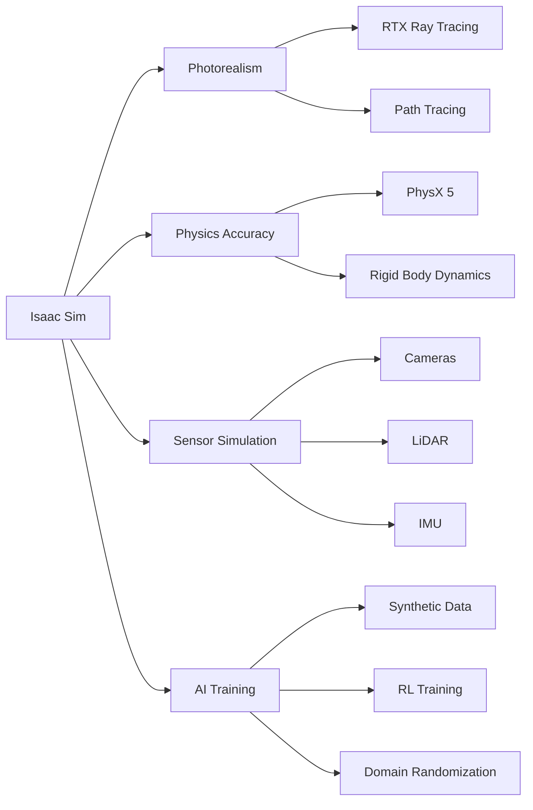
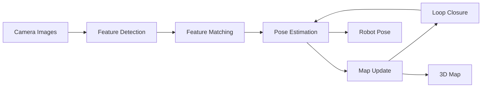
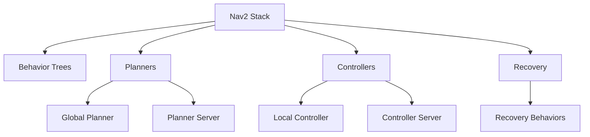

# Chapter 4: The AI-Robot Brain – NVIDIA Isaac Sim

## Introduction to NVIDIA Isaac

The NVIDIA Isaac ecosystem is a comprehensive suite of tools and platforms designed to streamline the development and deployment of AI-powered robots. It leverages NVIDIA's expertise in GPU-accelerated computing and AI to provide cutting-edge capabilities for robotics developers.

### Isaac Ecosystem Components

- **Isaac Sim** - Photorealistic simulation platform
- **Isaac ROS** - GPU-accelerated ROS 2 packages
- **Isaac Manipulator** - Manipulation-focused tools
- **Isaac AMR** - Autonomous mobile robot solutions

## Isaac Sim: Photorealistic Simulation

**NVIDIA Isaac Sim** is a scalable, physically accurate, and photorealistic robotics simulation platform built on NVIDIA Omniverse. Unlike traditional simulators that prioritize either physics or visuals, Isaac Sim excels at both.

### Core Capabilities



### Why Photorealism Matters

Photorealistic simulation is crucial for:

1. **Vision AI Training** - Realistic images for deep learning
2. **Sensor Accuracy** - True-to-life sensor behavior
3. **Sim-to-Real Transfer** - Minimize domain gap
4. **Human Evaluation** - Realistic demonstrations

### Synthetic Data Generation

Isaac Sim can generate massive amounts of labeled training data:

```python
# Example: Generating synthetic camera data
import omni.isaac.core
from omni.isaac.synthetic_utils import SyntheticDataHelper

# Initialize synthetic data helper
sd_helper = SyntheticDataHelper()

# Configure camera sensor
camera_config = {
    "resolution": (1920, 1080),
    "fov": 90,
    "position": (0, 0, 1.5),
    "rotation": (0, 0, 0)
}

# Generate annotated images
for i in range(1000):
    # Randomize scene
    randomize_scene()
    
    # Capture data
    rgb_image = sd_helper.get_rgb()
    depth_image = sd_helper.get_depth()
    segmentation = sd_helper.get_segmentation()
    bounding_boxes = sd_helper.get_bounding_boxes()
    
    # Save with annotations
    save_training_sample(i, rgb_image, depth_image, 
                         segmentation, bounding_boxes)
```

### Domain Randomization

Randomizing simulation parameters improves real-world transfer:

| Parameter | Randomization Range |
|-----------|-------------------|
| **Lighting** | Intensity, color temperature, direction |
| **Textures** | Materials, colors, patterns |
| **Object Poses** | Position, orientation, scale |
| **Camera** | Exposure, noise, blur |
| **Physics** | Friction, mass, damping |

## Visual SLAM (VSLAM)

**Simultaneous Localization and Mapping** is fundamental for autonomous robots. VSLAM uses camera images to:

1. **Localize** - Determine robot position and orientation
2. **Map** - Build 3D representation of environment
3. **Track** - Maintain consistent pose estimates

### VSLAM Pipeline



### Popular VSLAM Algorithms

| Algorithm | Type | Strengths |
|-----------|------|-----------|
| **ORB-SLAM3** | Feature-based | Robust, accurate, multi-sensor |
| **RTAB-Map** | RGB-D | Loop closure, large-scale mapping |
| **SVO** | Semi-direct | Fast, efficient |
| **LSD-SLAM** | Direct | Dense reconstruction |

### Implementing VSLAM in Isaac Sim

```python
# Example: VSLAM setup with Isaac Sim
from omni.isaac.core import World
from omni.isaac.core.robots import Robot
from omni.isaac.slam import VisualSLAM

# Create world and robot
world = World()
robot = world.scene.add(Robot(prim_path="/World/robot"))

# Configure VSLAM
vslam = VisualSLAM(
    camera_topic="/camera/image_raw",
    camera_info_topic="/camera/camera_info",
    map_frame="map",
    odom_frame="odom",
    base_frame="base_link"
)

# Run simulation with VSLAM
while simulation_running:
    world.step()
    
    # Get current pose estimate
    pose = vslam.get_current_pose()
    
    # Get map points
    map_points = vslam.get_map_points()
    
    # Visualize
    visualize_pose_and_map(pose, map_points)
```

### VSLAM Challenges

- **Lighting Changes** - Varying illumination affects features
- **Motion Blur** - Fast movements degrade image quality
- **Textureless Surfaces** - Few features to track
- **Dynamic Objects** - Moving objects confuse mapping
- **Loop Closure** - Recognizing previously visited locations

## Nav2: Advanced Navigation

**Nav2** is the second generation of ROS navigation software, providing a flexible framework for autonomous mobile robot navigation.

### Nav2 Architecture



### Key Components

1. **Global Planner** - High-level path from start to goal
2. **Local Controller** - Real-time trajectory following
3. **Costmap** - Obstacle representation
4. **Recovery Behaviors** - Handle stuck situations
5. **Behavior Trees** - Task coordination

### Adapting Nav2 for Humanoids

Humanoid bipedal locomotion requires special considerations:

#### Footstep Planning

```python
# Humanoid footstep planner
class HumanoidFootstepPlanner:
    def __init__(self, step_length=0.3, step_width=0.2):
        self.step_length = step_length
        self.step_width = step_width
    
    def plan_footsteps(self, start_pose, goal_pose):
        footsteps = []
        current_pose = start_pose
        
        while not reached_goal(current_pose, goal_pose):
            # Alternate left and right steps
            next_foot = 'left' if len(footsteps) % 2 == 0 else 'right'
            
            # Calculate next footstep
            next_step = self.calculate_step(
                current_pose, 
                goal_pose, 
                next_foot
            )
            
            footsteps.append(next_step)
            current_pose = next_step.pose
        
        return footsteps
```

#### Stability Constraints

- **Zero Moment Point (ZMP)** - Maintain balance
- **Center of Mass (CoM)** - Control body position
- **Support Polygon** - Stay within stable region

### Nav2 Configuration for Humanoids

```yaml
# humanoid_nav2_params.yaml
controller_server:
  ros__parameters:
    controller_frequency: 20.0
    FollowPath:
      plugin: "dwb_core::DWBLocalPlanner"
      # Humanoid-specific parameters
      max_vel_x: 0.5  # Slower than wheeled robots
      max_vel_theta: 0.3
      min_vel_x: 0.1
      acc_lim_x: 0.3  # Conservative acceleration
      acc_lim_theta: 0.5
      
      # Footstep constraints
      xy_goal_tolerance: 0.05
      yaw_goal_tolerance: 0.1
      
planner_server:
  ros__parameters:
    planner_plugins: ["GridBased"]
    GridBased:
      plugin: "nav2_navfn_planner/NavfnPlanner"
      tolerance: 0.1
      use_astar: true
      allow_unknown: false
```

### Dynamic Obstacle Avoidance

```python
# Real-time obstacle avoidance for humanoids
class HumanoidObstacleAvoider:
    def __init__(self, safety_margin=0.3):
        self.safety_margin = safety_margin
    
    def compute_safe_velocity(self, current_vel, obstacles, goal):
        # Dynamic window approach adapted for bipedal gait
        safe_velocities = []
        
        for v_x in velocity_range_x:
            for v_theta in velocity_range_theta:
                # Check if velocity is kinematically feasible
                if self.is_feasible_gait(v_x, v_theta):
                    # Simulate trajectory
                    trajectory = self.predict_trajectory(v_x, v_theta)
                    
                    # Check collision
                    if self.is_collision_free(trajectory, obstacles):
                        # Score based on progress to goal
                        score = self.evaluate_trajectory(
                            trajectory, goal, v_x, v_theta
                        )
                        safe_velocities.append((v_x, v_theta, score))
        
        # Select best velocity
        if safe_velocities:
            return max(safe_velocities, key=lambda x: x[2])
        else:
            return (0, 0, 0)  # Stop if no safe option
```

## Reinforcement Learning in Isaac Sim

Isaac Sim provides an excellent environment for training robot behaviors using RL:

### RL Training Pipeline

1. **Environment Setup** - Define state, action, reward
2. **Policy Network** - Neural network for decision-making
3. **Training Loop** - Interact, collect data, update policy
4. **Evaluation** - Test in varied scenarios
5. **Deployment** - Transfer to real robot

### Example: Training Bipedal Walking

```python
import torch
from omni.isaac.gym import VecEnvRLGames

class HumanoidWalkingEnv:
    def __init__(self):
        self.observation_space = 48  # Joint angles, velocities, IMU
        self.action_space = 12  # Joint torques
    
    def reset(self):
        # Reset robot to standing position
        return self.get_observation()
    
    def step(self, action):
        # Apply joint torques
        self.robot.apply_torques(action)
        
        # Step simulation
        self.world.step()
        
        # Calculate reward
        reward = self.calculate_reward()
        
        # Check termination
        done = self.is_fallen() or self.reached_goal()
        
        return self.get_observation(), reward, done, {}
    
    def calculate_reward(self):
        # Reward forward progress
        forward_reward = self.robot.get_velocity().x
        
        # Penalty for falling
        height_penalty = -10 if self.robot.height < 0.5 else 0
        
        # Energy efficiency
        energy_penalty = -0.01 * torch.sum(torch.abs(self.robot.torques))
        
        return forward_reward + height_penalty + energy_penalty
```

## Assessment: Isaac Perception Pipeline

### Project Requirements

Implement and evaluate a complete perception and navigation pipeline for a humanoid robot in Isaac Sim.

#### Part 1: VSLAM Implementation (40%)

- Set up Isaac Sim scene with humanoid robot
- Configure camera sensors (RGB-D or stereo)
- Implement VSLAM algorithm (ORB-SLAM3 or RTAB-Map)
- Demonstrate mapping of unknown environment
- Evaluate localization accuracy

#### Part 2: Nav2 Integration (40%)

- Configure Nav2 for bipedal locomotion
- Implement footstep planning
- Set up costmaps with appropriate parameters
- Demonstrate goal-oriented navigation
- Handle dynamic obstacles

#### Part 3: Performance Analysis (20%)

- Map quality metrics (coverage, accuracy)
- Localization error analysis
- Navigation success rate
- Computational performance
- Video demonstration

### Evaluation Criteria

| Criterion | Weight | Description |
|-----------|--------|-------------|
| VSLAM Accuracy | 25% | Map quality, localization precision |
| Nav2 Configuration | 25% | Appropriate parameters for humanoid |
| Navigation Performance | 25% | Success rate, path quality |
| Analysis & Documentation | 25% | Thorough evaluation, clear reporting |

## Key Takeaways

🔑 **Isaac Sim** provides photorealistic simulation for robotics AI  
🔑 **Synthetic data** accelerates vision AI training  
🔑 **VSLAM** enables autonomous localization and mapping  
🔑 **Nav2** provides flexible navigation for mobile robots  
🔑 **Domain randomization** improves sim-to-real transfer  
🔑 **RL training** in simulation enables complex behaviors  

## Further Reading

- NVIDIA Isaac Sim Documentation: https://docs.omniverse.nvidia.com/isaacsim/
- Nav2 Documentation: https://navigation.ros.org/
- Mur-Artal, R., & Tardós, J. D. (2017). "ORB-SLAM2: An open-source SLAM system for monocular, stereo, and RGB-D cameras." *IEEE TRO*.
- Macenski, S., et al. (2020). "The Marathon 2: A Navigation System." *IROS*.

---

**Navigation:**  
← [Module Overview](./overview.md) | [Module 4: VLA Systems →](../module-04-vla-systems/overview.md)
