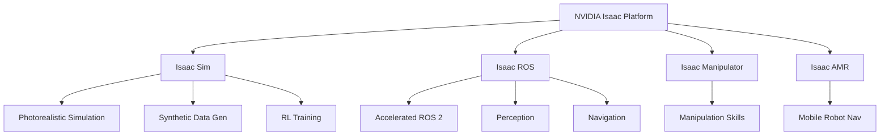

# Module 3: NVIDIA Isaac Sim

## The AI-Robot Brain

Welcome to Module 3, where you'll explore NVIDIA Isaac Sim – a cutting-edge platform for photorealistic simulation and AI training. Isaac Sim serves as the "AI brain" for humanoid robots, providing the environment to train intelligent perception, navigation, and manipulation systems.

## Module Overview

Building advanced AI for humanoid robots requires robust tools for both development and training. This module introduces the NVIDIA Isaac ecosystem, focusing on Isaac Sim for accelerating robotics development through photorealistic simulation and AI integration.

### What You'll Learn

- **NVIDIA Isaac ecosystem** overview
- **Isaac Sim** for photorealistic simulation
- **Synthetic data generation** for AI training
- **Visual SLAM (VSLAM)** implementation
- **Nav2** integration for humanoid navigation
- **Domain randomization** techniques

## Learning Objectives

By the end of this module, you will be able to:

✅ Understand the NVIDIA Isaac ecosystem and its components  
✅ Set up and use Isaac Sim for robot simulation  
✅ Generate synthetic training data for AI models  
✅ Implement Visual SLAM for localization and mapping  
✅ Configure Nav2 for humanoid bipedal navigation  
✅ Apply domain randomization for robust AI training  
✅ Transfer trained models from simulation to real robots  

## Why Isaac Sim?

Isaac Sim offers unique advantages for robotics AI development:

| Feature | Benefit |
|---------|---------|
| **Photorealism** | Train vision AI with realistic synthetic data |
| **GPU Acceleration** | Fast simulation and training on NVIDIA GPUs |
| **RTX Ray Tracing** | Accurate lighting and sensor simulation |
| **Physics Accuracy** | PhysX 5 for realistic dynamics |
| **ROS 2 Integration** | Seamless connection to robotics stack |
| **Scalability** | Parallel simulations for faster training |

## NVIDIA Isaac Ecosystem

## Module Structure

### Chapter 4: The AI-Robot Brain – NVIDIA Isaac Sim

Comprehensive coverage of Isaac Sim for perception, navigation, and AI training for humanoid robots.

## Key Technologies

### Visual SLAM (VSLAM)

**Simultaneous Localization and Mapping** using camera images:
- Build 3D maps of unknown environments
- Track robot position in real-time
- Enable autonomous navigation

### Nav2

**ROS 2 Navigation Stack** adapted for humanoids:
- Global path planning
- Local trajectory optimization
- Dynamic obstacle avoidance
- Recovery behaviors

## Assessment: Isaac Perception Pipeline

Implement and evaluate a perception pipeline using NVIDIA Isaac Sim.

**Requirements:**
- VSLAM implementation for a humanoid robot
- Nav2 configuration for bipedal locomotion
- Goal-oriented navigation with obstacle avoidance
- Map quality and localization accuracy evaluation

**Deliverables:**
- Isaac Sim scene with humanoid robot
- VSLAM configuration and launch files
- Nav2 parameter tuning documentation
- Performance analysis and demonstration video

## Time Allocation

**Weeks 8-11** of the 13-week course schedule

- **Week 8:** Isaac Sim introduction, setup, basic simulation
- **Week 9:** Photorealistic rendering, synthetic data generation
- **Week 10:** VSLAM implementation and testing
- **Week 11:** Nav2 integration, advanced navigation

## Prerequisites

- Completion of Modules 1 and 2
- NVIDIA GPU (RTX series recommended)
- Understanding of computer vision basics
- Familiarity with navigation concepts

## Hardware Requirements

### Minimum Specifications
- NVIDIA RTX 2070 or better
- 16GB RAM
- Ubuntu 20.04 or 22.04
- 50GB free disk space

### Recommended Specifications
- NVIDIA RTX 4070/4080/4090
- 32GB+ RAM
- Fast NVMe SSD
- Multi-core CPU (8+ cores)

## Next Steps

Begin with [Chapter 4: The AI-Robot Brain](./chapter-04-ai-robot-brain.md) to explore Isaac Sim's capabilities for robotics AI development.

---

**Navigation:**  
← [Module 2](../module-02-digital-twins/chapter-03-simulation.md) | [Chapter 4 →](./chapter-04-ai-robot-brain.md)
