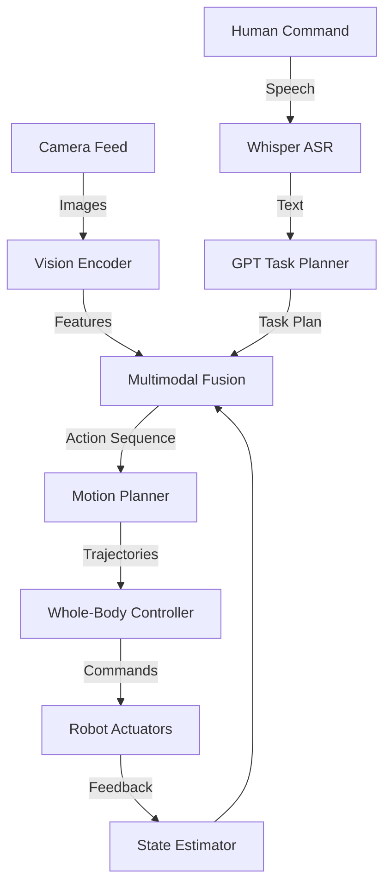

# Chapter 5: Vision-Language-Action Systems

## Introduction to VLA for Cognitive Robotics

Traditional robotics often separates perception, planning, and control into distinct modules. **Vision-Language-Action (VLA) systems** aim to unify these by allowing a robot to process visual information from its cameras, interpret natural language commands, and then generate appropriate physical actions.

This holistic approach enables **cognitive robotics**, where robots can reason about their environment, understand high-level goals, and adapt their behavior dynamically, much like humans do.

### VLA System Architecture



## Bipedal Locomotion and Humanoid Dynamics

One of the most challenging aspects of humanoid robotics is achieving stable and agile **bipedal locomotion**. Unlike wheeled robots, humanoids must maintain balance while walking, running, and navigating uneven terrain.

### Fundamental Concepts

#### Center of Mass (CoM)

The **center of mass** is the average position of all mass in the robot. For stable walking, the CoM must be controlled carefully.

```python
def calculate_com(robot_state):
    """Calculate center of mass from link masses and positions"""
    total_mass = 0
    com_position = np.zeros(3)
    
    for link in robot_state.links:
        total_mass += link.mass
        com_position += link.mass * link.position
    
    com_position /= total_mass
    return com_position
```

#### Zero Moment Point (ZMP)

The **Zero Moment Point** is a point on the ground where the total moment from gravity and inertia forces is zero. For stable walking, the ZMP must stay within the support polygon (the area defined by the feet in contact with the ground).

```python
class ZMPController:
    def __init__(self, robot):
        self.robot = robot
    
    def compute_zmp(self):
        """Compute current ZMP position"""
        com = self.robot.get_com()
        com_accel = self.robot.get_com_acceleration()
        
        # Simplified ZMP calculation
        zmp_x = com.x - (com.z / 9.81) * com_accel.x
        zmp_y = com.y - (com.z / 9.81) * com_accel.y
        
        return (zmp_x, zmp_y)
    
    def is_stable(self, zmp, support_polygon):
        """Check if ZMP is within support polygon"""
        return point_in_polygon(zmp, support_polygon)
```

### Gait Generation

A **gait** is a rhythmic pattern of joint movements that produces walking. Common approaches include:

#### 1. Trajectory-Based Gait

Pre-defined joint trajectories for each phase of walking:

```python
class TrajectoryGait:
    def __init__(self, step_length=0.3, step_height=0.05):
        self.step_length = step_length
        self.step_height = step_height
        self.phase = 0.0
    
    def generate_foot_trajectory(self, t, is_swing_phase):
        """Generate foot trajectory during swing phase"""
        if is_swing_phase:
            # Swing phase: lift and move foot forward
            x = self.step_length * (t / self.swing_duration)
            z = self.step_height * np.sin(np.pi * t / self.swing_duration)
            return (x, 0, z)
        else:
            # Stance phase: foot on ground
            return (0, 0, 0)
```

#### 2. Model Predictive Control (MPC)

Optimize future trajectories in real-time:

```python
class MPCWalkingController:
    def __init__(self, horizon=10, dt=0.1):
        self.horizon = horizon
        self.dt = dt
    
    def optimize_trajectory(self, current_state, goal_velocity):
        """Optimize footstep sequence for next N steps"""
        # Define cost function
        def cost(footsteps):
            total_cost = 0
            
            # Track desired velocity
            velocity_cost = (footsteps.velocity - goal_velocity)**2
            
            # Maintain stability (ZMP within support)
            stability_cost = self.zmp_violation_cost(footsteps)
            
            # Minimize energy
            energy_cost = np.sum(footsteps.torques**2)
            
            total_cost = velocity_cost + 10*stability_cost + 0.1*energy_cost
            return total_cost
        
        # Optimize
        optimal_footsteps = minimize(cost, initial_guess)
        return optimal_footsteps
```

### Whole-Body Control

Coordinating all joints simultaneously while maintaining balance and performing tasks:

```python
class WholeBodyController:
    def __init__(self, robot):
        self.robot = robot
        self.num_joints = robot.num_joints
    
    def compute_joint_torques(self, desired_com, desired_foot_poses, desired_hand_pose):
        """Compute joint torques for whole-body task"""
        # Build task hierarchy
        tasks = [
            Task("balance", priority=1, target=desired_com),
            Task("left_foot", priority=2, target=desired_foot_poses[0]),
            Task("right_foot", priority=2, target=desired_foot_poses[1]),
            Task("hand", priority=3, target=desired_hand_pose)
        ]
        
        # Solve hierarchical QP
        joint_accelerations = self.solve_hierarchical_qp(tasks)
        
        # Convert to torques using inverse dynamics
        torques = self.robot.inverse_dynamics(joint_accelerations)
        
        return torques
```

## Manipulation with Humanoid Robots

Beyond locomotion, humanoid robots need to interact with objects using their hands or grippers.

### Inverse Kinematics

Calculate joint angles to reach a desired end-effector pose:

```python
from scipy.optimize import minimize

class InverseKinematics:
    def __init__(self, robot_arm):
        self.arm = robot_arm
    
    def solve_ik(self, target_pose, current_joints):
        """Solve IK for target end-effector pose"""
        def cost(joint_angles):
            # Forward kinematics
            current_pose = self.arm.forward_kinematics(joint_angles)
            
            # Position error
            pos_error = np.linalg.norm(current_pose.position - target_pose.position)
            
            # Orientation error
            ori_error = self.orientation_distance(current_pose.orientation, 
                                                   target_pose.orientation)
            
            return pos_error + 0.5 * ori_error
        
        # Optimize
        result = minimize(cost, current_joints, 
                         bounds=self.arm.joint_limits)
        
        return result.x
```

### Grasping Strategies

```python
class GraspPlanner:
    def __init__(self):
        self.grasp_database = self.load_grasp_database()
    
    def plan_grasp(self, object_pointcloud, object_category):
        """Plan grasp for detected object"""
        # Get candidate grasps from database
        candidates = self.grasp_database[object_category]
        
        # Score each grasp
        scores = []
        for grasp in candidates:
            # Check collision
            if self.is_collision_free(grasp, object_pointcloud):
                # Score based on stability and reachability
                stability = self.compute_grasp_stability(grasp)
                reachability = self.compute_reachability(grasp)
                scores.append(stability * reachability)
            else:
                scores.append(0)
        
        # Select best grasp
        best_idx = np.argmax(scores)
        return candidates[best_idx]
```

## Voice-to-Action with OpenAI Whisper

**OpenAI Whisper** is an advanced automatic speech recognition (ASR) system that accurately transcribes human speech into text.

### Whisper Integration

```python
import whisper
import pyaudio
import numpy as np

class VoiceCommandSystem:
    def __init__(self, model_size="base"):
        # Load Whisper model
        self.model = whisper.load_model(model_size)
        
        # Audio configuration
        self.sample_rate = 16000
        self.chunk_size = 1024
    
    def listen_for_command(self, duration=5):
        """Record audio and transcribe"""
        # Record audio
        audio = pyaudio.PyAudio()
        stream = audio.open(
            format=pyaudio.paInt16,
            channels=1,
            rate=self.sample_rate,
            input=True,
            frames_per_buffer=self.chunk_size
        )
        
        print("Listening...")
        frames = []
        for _ in range(int(self.sample_rate / self.chunk_size * duration)):
            data = stream.read(self.chunk_size)
            frames.append(np.frombuffer(data, dtype=np.int16))
        
        stream.stop_stream()
        stream.close()
        
        # Transcribe
        audio_data = np.concatenate(frames).astype(np.float32) / 32768.0
        result = self.model.transcribe(audio_data)
        
        return result["text"]
```

### Command Parsing

```python
import re

class CommandParser:
    def __init__(self):
        self.command_patterns = {
            "navigate": r"(go to|walk to|move to) (?P<location>\w+)",
            "pick": r"(pick up|grab|take) (?P<object>\w+)",
            "place": r"(place|put) (?P<object>\w+) (on|in) (?P<location>\w+)",
            "follow": r"follow (?P<target>\w+)"
        }
    
    def parse(self, text):
        """Extract structured command from text"""
        text = text.lower()
        
        for command_type, pattern in self.command_patterns.items():
            match = re.search(pattern, text)
            if match:
                return {
                    "type": command_type,
                    "params": match.groupdict()
                }
        
        return {"type": "unknown", "params": {}}
```

## GPT for Conversational Robotics

Large language models like **GPT** enable humanoid robots to engage in natural dialogue and perform complex reasoning.

### Task Planning with GPT

```python
import openai

class GPTTaskPlanner:
    def __init__(self, api_key):
        openai.api_key = api_key
        self.system_prompt = """You are a task planner for a humanoid robot.
        Given a high-level command, break it down into executable sub-tasks.
        Available actions: navigate(location), pick(object), place(object, location),
        open(container), close(container), wait(duration)."""
    
    def plan_task(self, user_command, scene_description):
        """Generate task plan from natural language command"""
        messages = [
            {"role": "system", "content": self.system_prompt},
            {"role": "user", "content": f"Scene: {scene_description}\nCommand: {user_command}\nGenerate step-by-step plan:"}
        ]
        
        response = openai.ChatCompletion.create(
            model="gpt-4",
            messages=messages,
            temperature=0.3
        )
        
        plan_text = response.choices[0].message.content
        return self.parse_plan(plan_text)
    
    def parse_plan(self, plan_text):
        """Convert text plan to executable actions"""
        actions = []
        for line in plan_text.split('\n'):
            if line.strip().startswith('-') or line.strip()[0].isdigit():
                action = self.extract_action(line)
                if action:
                    actions.append(action)
        return actions
```

### Conversational Interaction

```python
class ConversationalRobot:
    def __init__(self, gpt_planner, voice_system):
        self.planner = gpt_planner
        self.voice = voice_system
        self.conversation_history = []
    
    def interact(self):
        """Main interaction loop"""
        while True:
            # Listen for command
            user_speech = self.voice.listen_for_command()
            print(f"User: {user_speech}")
            
            # Add to history
            self.conversation_history.append({
                "role": "user",
                "content": user_speech
            })
            
            # Check if it's a question or command
            if self.is_question(user_speech):
                response = self.answer_question(user_speech)
                self.speak(response)
            else:
                # Plan and execute task
                plan = self.planner.plan_task(
                    user_speech,
                    self.get_scene_description()
                )
                
                self.speak(f"I will {self.summarize_plan(plan)}")
                self.execute_plan(plan)
                self.speak("Task completed!")
    
    def is_question(self, text):
        """Detect if input is a question"""
        question_words = ["what", "where", "when", "who", "why", "how", "can you"]
        return any(text.lower().startswith(word) for word in question_words) or text.endswith("?")
```

## Multimodal Integration

Combining vision, language, and action requires careful integration:

```python
class VLASystem:
    def __init__(self):
        self.vision = VisionSystem()
        self.language = LanguageSystem()
        self.action = ActionSystem()
    
    def process_command(self, voice_command):
        """Process multimodal command"""
        # 1. Transcribe speech
        text_command = self.language.transcribe(voice_command)
        
        # 2. Understand scene visually
        scene_objects = self.vision.detect_objects()
        scene_description = self.vision.describe_scene()
        
        # 3. Plan task with language model
        task_plan = self.language.plan_task(text_command, scene_description)
        
        # 4. Execute actions
        for action in task_plan:
            if action.type == "navigate":
                self.action.navigate_to(action.target)
            elif action.type == "pick":
                obj = self.vision.locate_object(action.object_name)
                self.action.pick_object(obj)
            elif action.type == "place":
                loc = self.vision.locate_surface(action.location)
                self.action.place_object(loc)
        
        return "Task completed successfully"
```

## Capstone Humanoid Project

### Project Overview

Integrate all course modules to create an intelligent humanoid robot capable of performing a complex, multi-step task in a simulated environment.

### Requirements

#### 1. Locomotion (25%)
- Stable bipedal walking in Isaac Sim
- Navigate to specified locations
- Avoid dynamic obstacles

#### 2. Perception (20%)
- VSLAM for localization
- Object detection and recognition
- Scene understanding

#### 3. Voice Interface (20%)
- Whisper integration for speech recognition
- Natural language command parsing
- Spoken feedback

#### 4. Task Planning (20%)
- GPT-based task decomposition
- Multi-step plan execution
- Error handling and recovery

#### 5. Manipulation (15%)
- Pick and place objects
- Grasp planning
- Collision avoidance

### Example Task Scenarios

1. **"Clean up the living room"**
   - Detect objects out of place
   - Plan pickup sequence
   - Navigate and grasp objects
   - Place in designated locations

2. **"Bring me a water bottle from the kitchen"**
   - Navigate to kitchen
   - Locate water bottle
   - Grasp and carry
   - Return and hand over

3. **"Set the table for dinner"**
   - Understand table setting requirements
   - Locate plates, utensils, glasses
   - Arrange in proper positions

### Deliverables

1. **System Architecture Document**
   - Component diagram
   - Data flow
   - Integration points

2. **Implementation**
   - ROS 2 packages
   - Isaac Sim scene
   - VLA pipeline code

3. **Demonstration Video** (5-7 minutes)
   - System overview
   - Task execution
   - Challenges and solutions

4. **Final Presentation** (15 minutes)
   - Technical approach
   - Results and evaluation
   - Future improvements

### Evaluation Criteria

| Criterion | Weight | Description |
|-----------|--------|-------------|
| System Integration | 25% | All modules work together seamlessly |
| Task Completion | 25% | Successfully completes assigned task |
| Robustness | 20% | Handles errors and edge cases |
| Innovation | 15% | Creative solutions and extensions |
| Documentation | 15% | Clear, comprehensive, professional |

## Key Takeaways

🔑 **VLA systems** unify vision, language, and action for cognitive robotics  
🔑 **Bipedal locomotion** requires careful control of CoM and ZMP  
🔑 **Whole-body control** coordinates all joints for complex tasks  
🔑 **Whisper** enables robust speech recognition for voice commands  
🔑 **GPT** provides high-level task planning and conversational abilities  
🔑 **Multimodal integration** is key to intelligent robot behavior  

## Further Reading

- Ahn, M., et al. (2022). "Do As I Can, Not As I Say: Grounding Language in Robotic Affordances." *arXiv*.
- Brohan, A., et al. (2023). "RT-2: Vision-Language-Action Models Transfer Web Knowledge to Robotic Control." *arXiv*.
- Kajita, S., et al. (2003). "Biped walking pattern generation by using preview control of zero-moment point." *ICRA*.

---

**Navigation:**  
← [Module Overview](./overview.md) | [Course Structure →](../course-structure/weekly-schedule.md)
