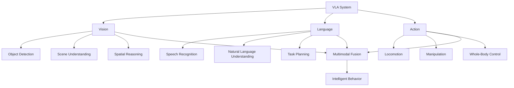

# Module 4: Vision-Language-Action (VLA) Systems

## Cognitive Robotics and Multimodal Intelligence

Welcome to the final module, where you'll integrate vision, language understanding, and physical actions to create truly intelligent humanoid robots. VLA systems represent the frontier of cognitive robotics, enabling robots to understand commands, perceive their environment, and execute complex tasks.

## Module Overview

The ultimate goal for advanced humanoid robots is to understand human commands, perceive the world around them, and execute complex physical actions – moving beyond pre-programmed routines to truly intelligent behavior.

### What You'll Learn

- **VLA system architecture** and integration
- **Bipedal locomotion** principles and control
- **Humanoid manipulation** strategies
- **Voice-to-action** with OpenAI Whisper
- **Conversational AI** with GPT models
- **Multimodal perception** and decision-making

## Learning Objectives

By the end of this module, you will be able to:

✅ Understand VLA system architecture for cognitive robotics  
✅ Explain bipedal locomotion dynamics and control strategies  
✅ Implement manipulation tasks for humanoid robots  
✅ Integrate speech recognition for natural language commands  
✅ Use large language models for task planning and dialogue  
✅ Combine vision, language, and action for complex behaviors  
✅ Develop a complete capstone humanoid robot system  

## What are VLA Systems?

**Vision-Language-Action** systems unify three critical modalities:

### Why VLA Matters

Traditional robotics separates perception, planning, and control. VLA systems integrate these to enable:

- **Natural interaction** - Understand and respond to human language
- **Context awareness** - Reason about visual scenes and language together
- **Adaptive behavior** - Adjust actions based on multimodal understanding
- **Cognitive capabilities** - Plan, reason, and learn from experience

## Module Structure

### Chapter 5: Vision-Language-Action Systems

Comprehensive coverage of VLA integration, bipedal locomotion, manipulation, and conversational robotics.

## Key Technologies

### OpenAI Whisper
State-of-the-art speech recognition for voice commands

### GPT Models
Large language models for task planning and dialogue

### Multimodal Transformers
Neural architectures that process vision and language together

## Assessment: Capstone Humanoid Project

The culminating project integrates all course modules into a complete humanoid robot system.

**Requirements:**
- Locomotion in simulated environment
- Voice command recognition
- Natural language task planning
- Object detection and manipulation
- Complete system demonstration

**Deliverables:**
- Integrated ROS 2 system
- Isaac Sim simulation environment
- VLA pipeline implementation
- Comprehensive documentation
- Final presentation and demonstration

## Time Allocation

**Weeks 12-13** of the 13-week course schedule

- **Week 12:** VLA integration, Whisper + GPT setup
- **Week 13:** Capstone project presentations and demos

## Prerequisites

- Completion of Modules 1, 2, and 3
- Understanding of deep learning basics
- Familiarity with transformer architectures (helpful)
- Access to API keys (OpenAI or alternatives)

## Next Steps

Dive into [Chapter 5: VLA Systems](./chapter-05-vla.md) to learn how to build cognitive capabilities for humanoid robots.

---

**Navigation:**  
← [Module 3](../module-03-isaac-sim/chapter-04-ai-robot-brain.md) | [Chapter 5 →](./chapter-05-vla.md)
